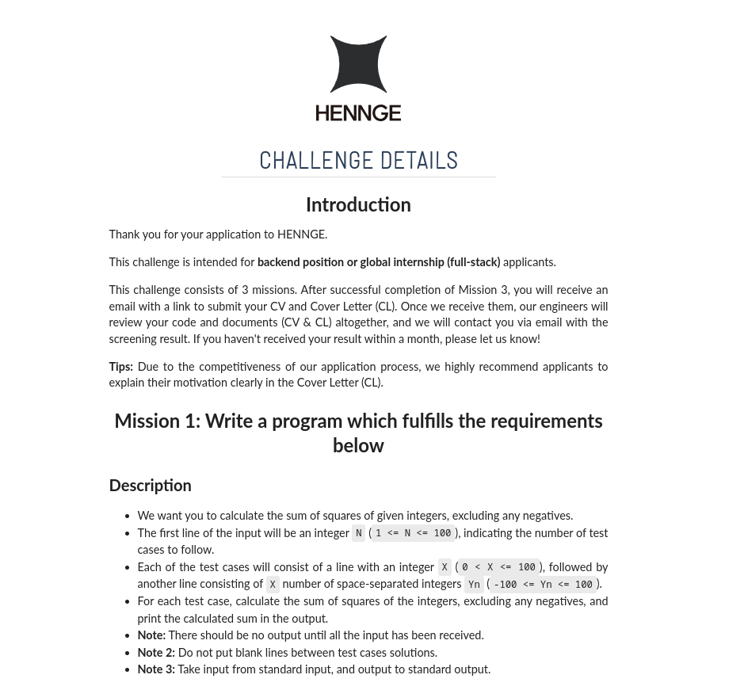
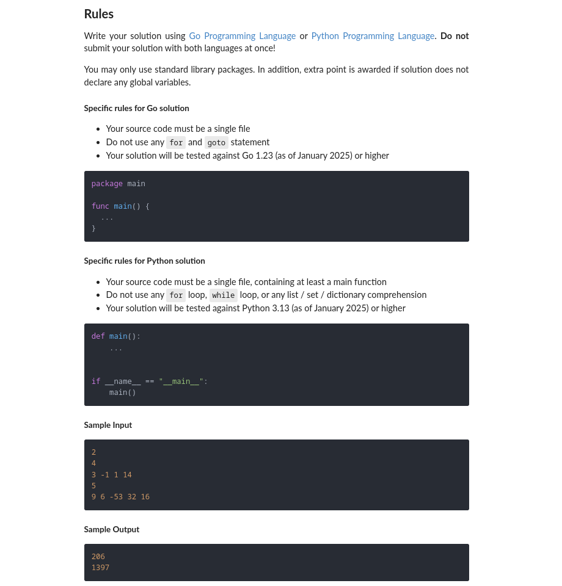
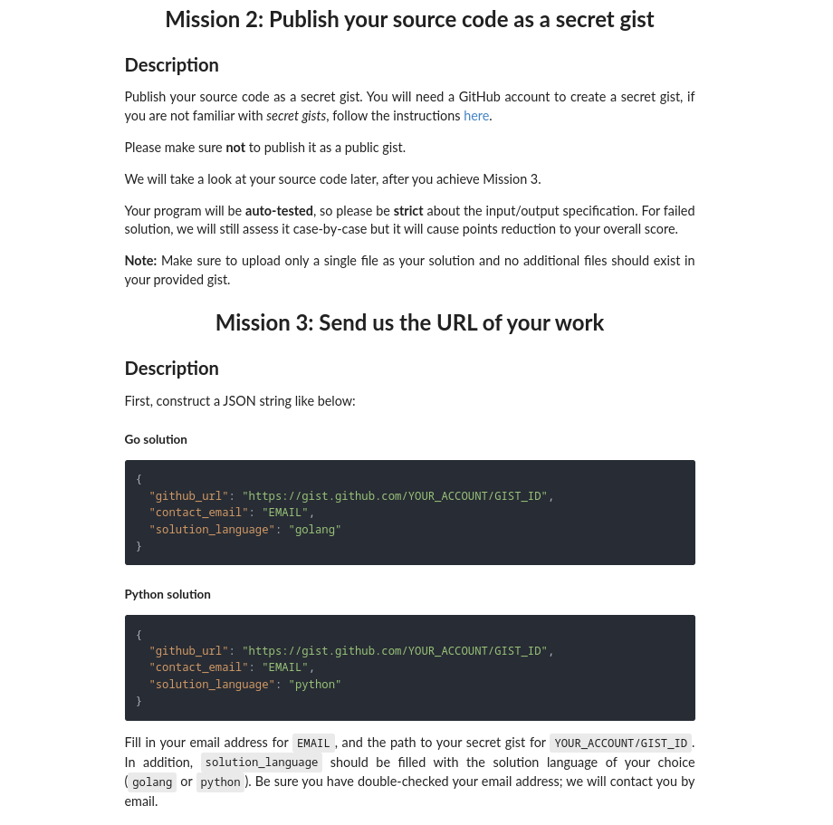
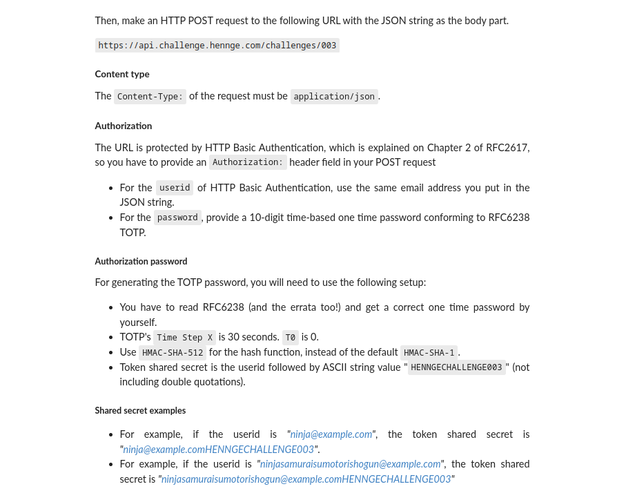
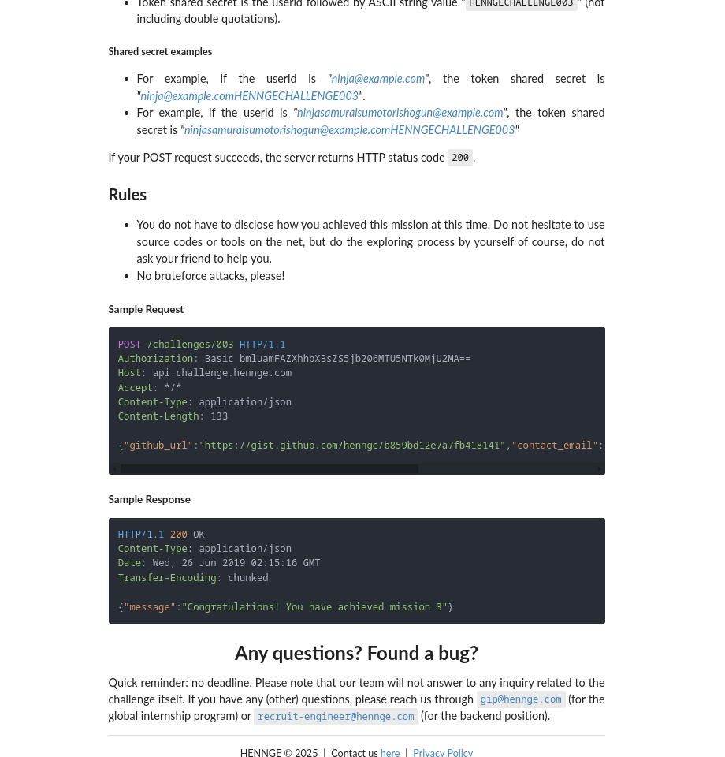

# Hennge's Japan internship challenge
They have this nice way of filtering out people which I find really cool.

Instead of receiving a gagillion curricula and using HR employees(which do not understand what they read and never will) or bots that scrape it to automatically discard you if you do not have a "BcA + PhD in communicating with dogs" and 10+ years of experience with Kubernetes in your skills section they ask you to send a carefully crafted POST request to one of their APIs endpoint with a solved coding problem they present.

Here you can find how I solved it.

Knowing me you will expect a certain care and attention in what I do and you are right thinking I have put it in this as well.

In fact as there was no maximum time to submit I took about one hour and a half to do it and make it as idiomatic as possible.

## Screenshots










## Opinions
This is really nice as the problem is rather simple to solve, but has various little ways to solve it better and show them you know what you are doing.

It would be a perfect solution to receiving too many applications if they were able to read yours and possibly even do what they advertised.

Now processCase(0) is what does the most work here, I made it an anonymous function, just because I enjoyed doing this I got curious about how the function stack would look like and did this
```
dlv exec bin/challenge
```
discovered that anonymous functions in Go have this kind of signature on the function call stack
```
(dlv) stack
0  0x000000000049b853 in main.main.func1
   at ./main.go:63
1  0x000000000049bb2b in main.main.func1
   at ./main.go:85
2  0x000000000049bb2b in main.main.func1
   at ./main.go:85
3  0x000000000049b7a6 in main.main
   at ./main.go:87
4  0x000000000043522b in runtime.main
   at /usr/lib/go/src/runtime/proc.go:272
5  0x000000000046bdc1 in runtime.goexit
   at /usr/lib/go/src/runtime/asm_amd64.s:1700
(dlv) continue
206
1397
Process 24002 has exited with status 0
```
which was nice also because being recursive, it's called a bunch of time based on the input.

Honestly for me it wasn't a waste of time and got something out of it!

I have no particular comments on the Python script generating the TOTP, but it's nice that they make you read the related RFC.

Now let's continue.

## Really fun facts
* A guy on medium has an [article](https://medium.com/henngeblog/getting-mind-blown-at-hennge-global-internship-program-7db9791980bc) on this and it's very convenient that he was(and imagine still is) located in Japan.
* Despite efforts put in making a personal and relevant cover letter(which you can read and even compile) as described in [Hennge's on creating the perfect cover letter](https://hennge.com/global/info/henka/interview/202403-crafting-the-perfect-cover-letter) the fact that I do not have a BaC and additional Phd in communicating with dogs and other animals discarded me from the selection, also I am Italian(not in Japan or the United States) and at the time did not have a Github profile which I guess didn't help, but goes to show that they haven't run, read the the code or even skimmed through the cover letter and possibly the curriculum.
* I hate corporate and I encourage any HENNGE employees to come to this address(Via I Maggio, 8, 21022 Azzate VA) and eat my ass or fight me, one the two.
Maybe with an 20 extra years of experience in the field in big companies and selling my kidney for an education I'll be able to be taken into consideration.

To the people of HENNGE because despite what it feels like companies are made by people \
you are not cool, you are surely smart, buy you will always be losers and I will now target you with jokes and explicit insults whenever I can. 

Have a good day.

[What is HENNGE?](https://youtu.be/z9RmzUCbdco?si=o6gt3d2qi3gdkvXy)

How about you change your uniform one more time you retard?

Ted Kaczynski had a good paper on the power of technology if you wanna read some.
